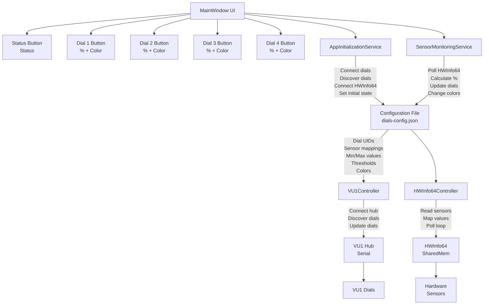
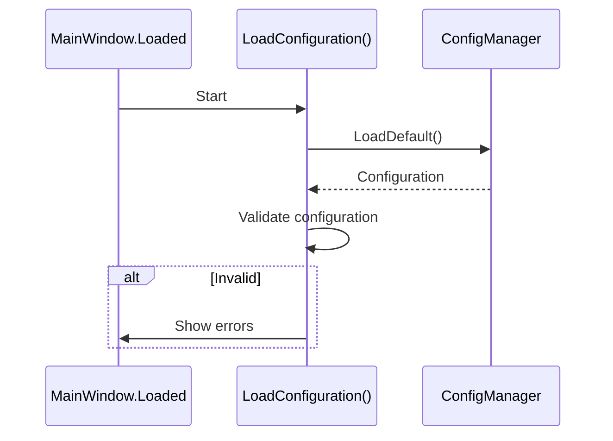
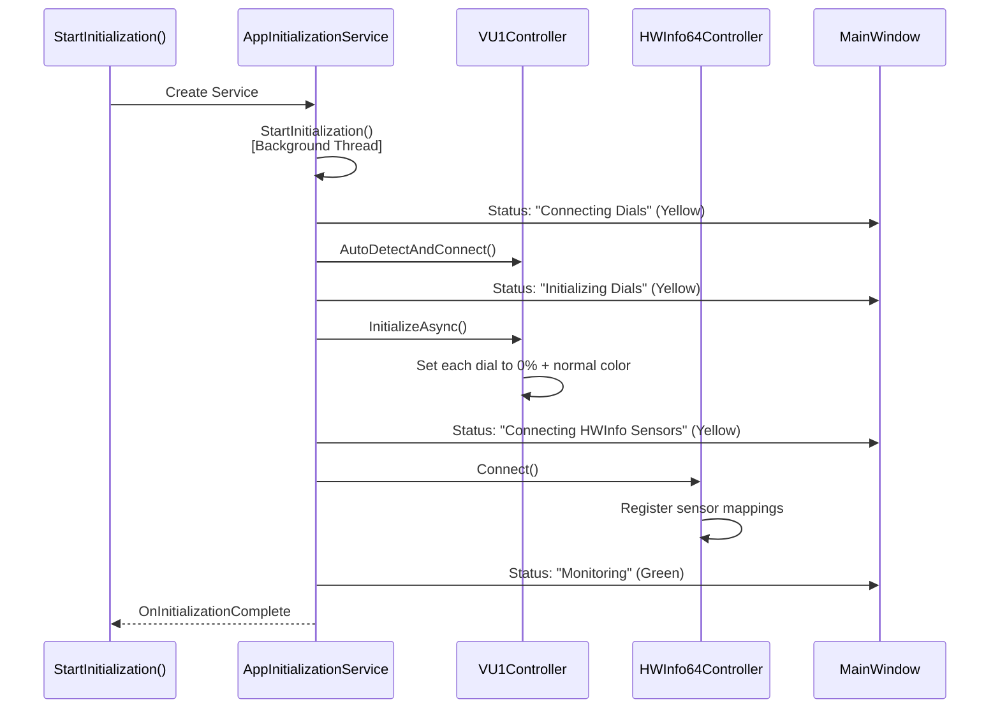
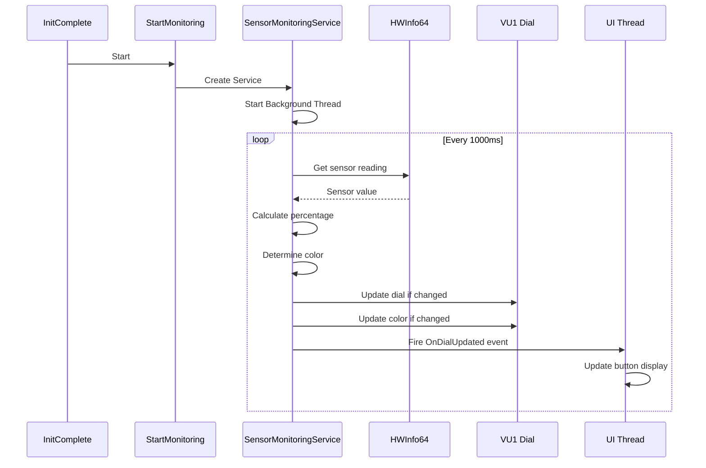

# VUWare.App - Complete System Guide

## Overview

VUWare.App is a WPF application that monitors HWInfo64 sensors in real-time and displays them on VU1 Gauge Hub dials with automatic color changes based on configurable thresholds.

## System Architecture



## Startup Sequence

### 1. Configuration Loading (Synchronous)



**Configuration File:** `Config/dials-config.json`

Contains:
- App settings (polling interval, debug mode)
- Dial configurations (UIDs, sensors, thresholds)
- Color mappings

### 2. Initialization Phase (Asynchronous)



### 3. Monitoring Phase (Continuous)



## Configuration File Structure

```json
{
  "version": "1.0",
  "appSettings": {
    "autoConnect": true,
    "enablePolling": true,
    "globalUpdateIntervalMs": 1000,
    "logFilePath": "",
    "debugMode": false
  },
  "dials": [
    {
      "dialUid": "290063000750524834313020",
      "displayName": "CPU Temperature",
      "sensorName": "CPU [#0]: AMD Ryzen 7 9700X: Enhanced",
      "entryName": "CPU (Tctl/Tdie)",
      "minValue": 20,
      "maxValue": 95,
      "warningThreshold": 75,
      "criticalThreshold": 88,
      "colorConfig": {
        "normalColor": "Green",
        "warningColor": "Orange",
        "criticalColor": "Red"
      },
      "enabled": true,
      "updateIntervalMs": 1000
    }
  ]
}
```

**Key Fields:**
- `dialUid` - Unique identifier (find with Console's "dials" command)
- `sensorName` - Exact HWInfo64 sensor name
- `entryName` - Exact HWInfo64 entry name
- `minValue` - Value mapped to 0% on dial
- `maxValue` - Value mapped to 100% on dial
- `warningThreshold` - Value to trigger warning color
- `criticalThreshold` - Value to trigger critical color

## UI Elements

### Status Button
- **Location:** Bottom of window
- **Shows:** Initialization or operation status
- **Colors:**
  - Gray: Idle
  - Yellow: In progress
  - Green: Monitoring
  - Red: Error

### Dial Buttons (1-4)
- **Location:** Top row
- **Shows:** Current dial percentage
- **Colors:**
  - Gray: Not monitoring
  - Green: Normal operation
  - Orange: Warning threshold reached
  - Red: Critical threshold reached
- **Tooltip:** Full sensor information

**Tooltip Example:**
```
CPU Temperature
Sensor: CPU (Tctl/Tdie)
Value: 62.5 °C
Dial: 66%
Color: Green
Updates: 1234
Last: 14:32:45
```

## Services Overview

### AppInitializationService
**Purpose:** Startup initialization
**Thread:** Background
**Phases:**
1. Connect to VU1 Hub
2. Discover dials via I2C
3. Connect to HWInfo64
4. Register sensor mappings

**Events:**
- `OnStatusChanged` - Status updates
- `OnError` - Error messages
- `OnInitializationComplete` - Ready to monitor

**Access:**
```csharp
var vu1 = _initService.GetVU1Controller();
var hwinfo = _initService.GetHWInfo64Controller();
```

### SensorMonitoringService
**Purpose:** Continuous monitoring
**Thread:** Background
**Operations:**
1. Poll HWInfo64 sensors
2. Map values to percentages
3. Apply threshold colors
4. Update VU1 dials

**Events:**
- `OnDialUpdated` - Dial changed
- `OnError` - Monitoring error

**Methods:**
```csharp
service.Start()              // Begin monitoring
service.Stop()               // Stop monitoring
service.GetDialStatus(uid)   // Get current state
service.IsMonitoring         // Check status
```

## Sensor Value Mapping

### Formula
```
Percentage = ((SensorValue - MinValue) / (MaxValue - MinValue)) * 100
Clamped to [0, 100]
```

### Example (CPU Temperature)
```
Configuration:
  minValue: 20°C
  maxValue: 95°C
  warningThreshold: 75°C
  criticalThreshold: 88°C

Readings:
  30°C  ? 15%  ? Green
  75°C  ? 73%  ? Orange (warning)
  88°C  ? 99%  ? Red (critical)
  95°C  ? 100% ? Red (critical)
```

## Threshold-Based Colors

Colors change automatically based on sensor value:

```
Dial Color Determination:

if (value >= criticalThreshold)
  ? color = criticalColor (typically Red)
else if (value >= warningThreshold)
  ? color = warningColor (typically Orange)
else
  ? color = normalColor (typically Green)
```

## Performance

| Aspect | Value | Notes |
|--------|-------|-------|
| Polling Interval | 1000ms | Configurable |
| Per-Dial Update Time | 100-200ms | Serial communication |
| Color Change Latency | 50-100ms | Via serial |
| Tooltip Update | <50ms | UI only |
| Memory Usage | ~20MB | Total application |
| CPU Usage | <1% | Idle between polls |

## Error Handling

### Configuration Errors
- **File not found:** Shows warning, disables app
- **Invalid JSON:** Shows error with details
- **Missing fields:** Shows validation errors
- **Invalid colors:** Shows which colors are invalid

### Initialization Errors
- **Connection failed:** Shows error message
- **Dial discovery failed:** Shows error message
- **HWInfo unavailable:** Shows warning, continues

### Monitoring Errors
- **Sensor not found:** Updates skipped for that dial
- **Serial communication failure:** Retries next cycle
- **HWInfo disconnect:** Continues if possible

## Troubleshooting

### App Won't Start
1. Check configuration file exists in `Config/` directory
2. Validate JSON syntax
3. Check VU1 Hub is powered and connected

### Status Button Stays Yellow
1. Check USB connection to VU1 Hub
2. Verify Hub appears in Device Manager
3. Check I2C cables to dials

### Dials Not Found
1. Power cycle entire system
2. Check I2C cable connections
3. Look for error messages in console

### Buttons Don't Update
1. Check HWInfo64 is running
2. Enable "Shared Memory Support" in HWInfo64 Options
3. Check sensor names in config match HWInfo64 exactly
4. Look for error messages in Status Button

### Colors Don't Change
1. Verify thresholds in config
2. Check sensor value range (use HWInfo64 to check)
3. Verify min/max values are correct
4. Check color names are valid

## Quick Start

### 1. Find Your Dial UIDs
```bash
# In VUWare.Console
> connect
> init
> dials
# Copy the UID from output
```

### 2. Find Your Sensor Names
```bash
# In VUWare.Console
> sensors
# Find your sensor and its entry names
# Example: CPU [#0]: AMD Ryzen 7 9700X > CPU (Tctl/Tdie)
```

### 3. Edit Configuration
```bash
# Edit VUWare.App/Config/dials-config.json
# Add your dial UID, sensor names, and thresholds
```

### 4. Determine Min/Max Values
```bash
# Run HWInfo64 and monitor sensor values
# Note minimum and maximum you typically see
# Set minValue to lowest expected
# Set maxValue to highest expected
```

### 5. Run the App
```bash
dotnet run --project VUWare.App
# Watch Status Button for initialization
# Once green, buttons will show real-time data
```

## Files

### Source Code
- `MainWindow.xaml` - UI layout
- `MainWindow.xaml.cs` - UI logic and event handling
- `AppInitializationService.cs` - Startup initialization
- `SensorMonitoringService.cs` - Continuous monitoring
- `ConfigManager.cs` - Configuration file I/O
- `DialConfiguration.cs` - Configuration models

### Configuration
- `Config/dials-config.json` - Application configuration

### Documentation
- `INITIALIZATION.md` - Initialization system details
- `MONITORING.md` - Monitoring system details
- `README.md` - Project overview

## Support

For issues:
1. Check troubleshooting section above
2. Enable debug mode in config: `"debugMode": true`
3. Check Console application for deeper diagnostics
4. Report issues on GitHub with config and error messages
