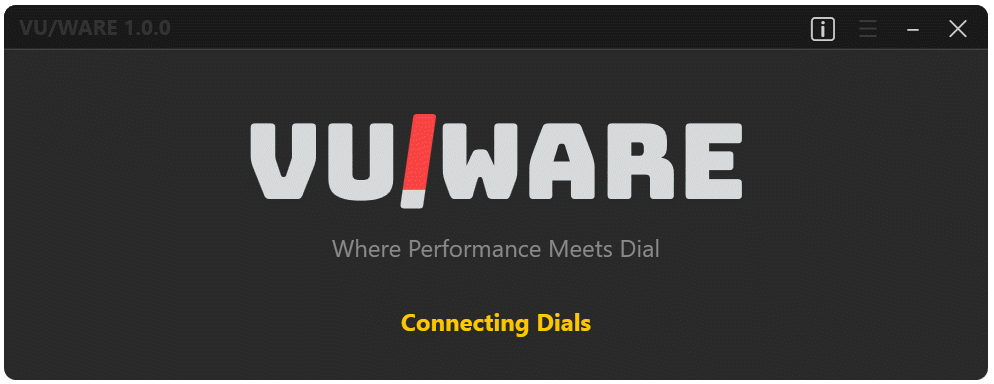
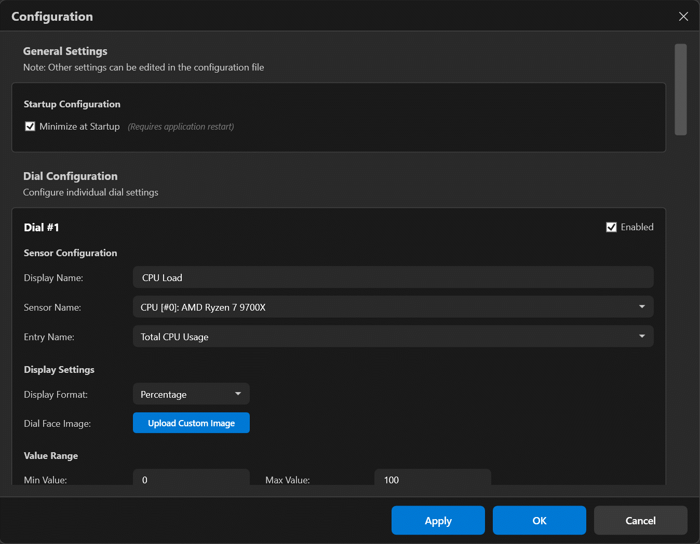
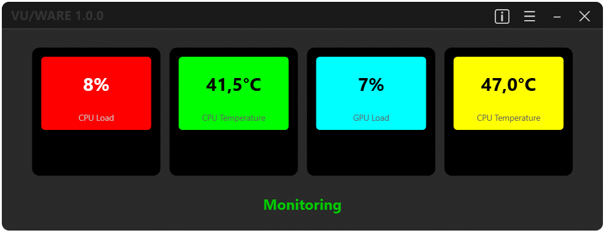

# VUWare - Where Performance Meets Dial

VUWare is a Windows desktop application that displays real-time system monitoring data from HWInfo64 on VU1 Gauge Hub analog dials. Monitor CPU temperature, GPU load, fan speeds, and any other sensor with beautiful analog gauges that change color based on your configured thresholds.

*VUWare - Real-time hardware monitoring on VU1 analog dials*

## About VUWare

### Project Background

Sasa Karanaovic and Streacom created a wonderful and ambitious software solution for the VU1 dials: a Python-based RESTful server app for communicating with the dials, and a "Demo App" showing how to use REST calls and an open-source hardware sensor library for monitoring.

As they stated: *"Calling it a demo app was a decision based on our long-term vision for the VU1. Rather than build a walled garden, forcing customers to use our proprietary application, we wanted the VU1 to be open to everyone. This would allow the VU1 to be used in scenarios far beyond our limited imagination and, more importantly, be utilized by ANY other apps or purpose. Continuing to develop the demo app would run contrary to that vision, and we see it as a stop-gap solution until 3rd party apps incorporate native support. In the near future, we expect that as VU1 adoption grows, the demo app will become redundant."*

While that's a valid approach, it also adds complexity (installation, startup), modest performance penalties (HTTP communication), and adoption has been slow. Moreover, the use of the open-source LibreHardwareMonitor sensor access library is problematic because it lags behind modern hardware. On some systems, important sensor values simply aren't available.

### Why VUWare?

Many users want a solution for their dials that is:

- Easy to install and use
- Automatically detects and configures the dials
- Supports modern hardware for monitoring
- Uses minimal system resources

VUWare was created to meet these needs. It's based on a C# library that communicates with the dials via serial port in a straightforward manner. This library can be used in any C# project and will soon be published as a NuGet package.

**VUWare.App** is the monitoring application that reads sensor data and sends it to the dials. It's based on HWInfo64—the well-known commercial solution that's free for non-commercial use. While HWInfo64 limits exports to 3rd party apps to 12 hours (which is plenty for most users), the app runs minimized in the system tray and uses almost no resources thanks to modern async patterns designed to be as unobtrusive as possible.

We now have the best of both worlds: Sasa's open vision for the VU1 platform, and a ready-to-use solution that just works!

## Key Features

### Real-Time Hardware Monitoring
- Display any HWInfo64 sensor on physical VU1 analog dials
- Monitor up to 4 sensors simultaneously (one per dial)
- Automatic color changes based on configurable warning and critical thresholds
- Live updates with configurable polling intervals (default: 1 second)

### Easy Configuration
- Graphical settings interface for configuring dials
- Browse and select from all available HWInfo64 sensors
- Set custom minimum/maximum ranges for each dial
- Configure warning and critical threshold values
- Choose colors for normal, warning, and critical states
- Upload custom dial face images for personalization

*Graphical settings interface for configuring dials*

### Automatic First-Run Setup
- Automatic detection of connected VU1 Gauge Hub
- Discovery of all connected dials via I2C
- Automatic opening of settings for easy sensor configuration
- HWInfo64 sensor browser for easy sensor selection

### Status Monitoring
- Visual status indicators for system state
- Real-time dial percentage display with color coding
- Detailed tooltips showing sensor values and update information
- Error reporting and diagnostics

## What You Need

### Hardware
- VU1 Gauge Hub - Connected via USB
- VU1 Analog Dials - 1 to 4 dials connected to the hub via I2C
- Windows PC - Windows 10 version 1809 or later (64-bit)

### Software
- HWInfo64 - Must be installed and running with "Shared Memory Support" enabled
- USB Serial Driver - Usually installed automatically by Windows

## Quick Start

1. Install VUWare - Download and run the installer
2. Connect Hardware - Plug in your VU1 Hub and dials
3. Launch HWInfo64 - Enable "Shared Memory Support" in settings
4. Run VUWare - Initialization happens automatically, then configure your sensors
5. Monitor - Watch your sensors come to life on analog dials!

*VUWare main window showing real-time sensor monitoring on VU1 dials*

!!! tip "First Time Users"
    On first run, VUWare automatically detects your hardware and opens the settings page for you to configure sensors. Just select your sensors and set thresholds!

## Documentation

- [Installation Guide](getting-started/installation.md) - Get VUWare installed and ready
- [First Launch](getting-started/first-launch.md) - Understand the initialization process and first-time setup
- [Configuration](getting-started/configuration.md) - Learn how to configure dials and sensors
- [Common Use Cases](user-guide/use-cases.md) - Real-world monitoring scenarios
- [Troubleshooting](user-guide/troubleshooting.md) - Solutions to common issues
- [Settings Reference](user-guide/settings.md) - Detailed settings documentation

## Example Monitoring Scenarios

**CPU Temperature**: Min 20C, Max 95C, Warning 75C, Critical 88C

**GPU Usage**: Min 0%, Max 100%, Warning 80%, Critical 95%

**Fan Speed**: Min 0 RPM, Max 3000 RPM, Warning 2400 RPM, Critical 2800 RPM

## Support & Community

- [Support & Help](about/support.md) - Get help and report issues
- [GitHub Issues](https://github.com/uweinside/VUWare/issues) - Bug reports and feature requests
- [GitHub Repository](https://github.com/uweinside/VUWare) - Source code

## License

VUWare is licensed under the MIT License.

Copyright (c) 2025 Uwe Baumann
